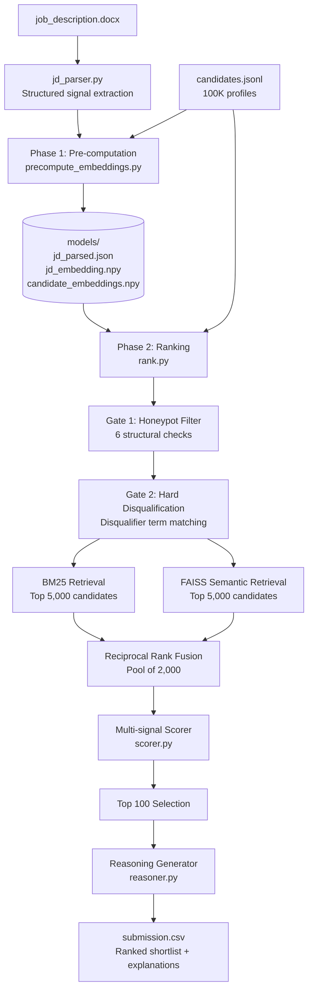
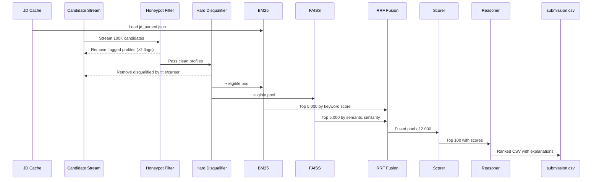
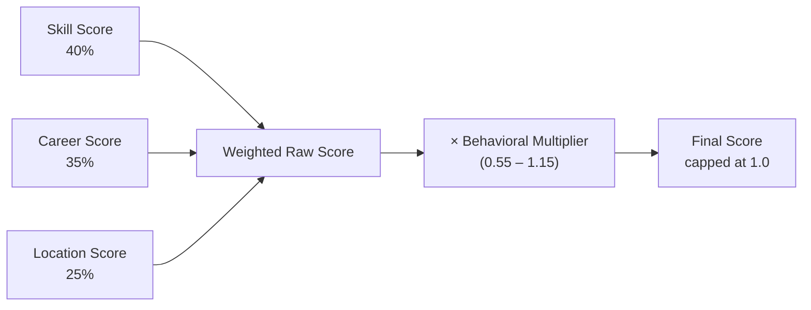
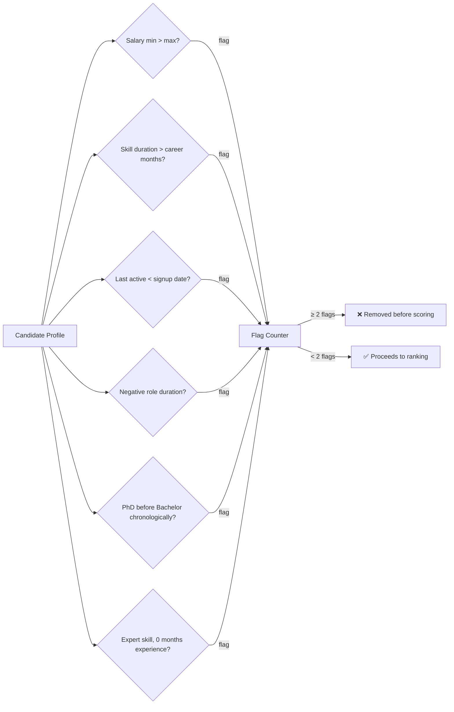

# RIE — Recruiter Intelligence Engine

> **Multi-signal AI candidate ranker.** Upload a job description and a candidate pool (maybe 100-100K). Get a ranked shortlist with a written reason for every pick in under 5 minutes, on CPU, with no GPU and no API calls.

[](https://huggingface.co/spaces/Shreya312004/rie-candidate-ranker)
[](https://www.python.org/)
[](LICENSE)

---

## Give It a Try Right Now

**No setup required.** The live Gradio demo is hosted on HuggingFace Spaces:

👉 **[https://huggingface.co/spaces/Shreya312004/rie-candidate-ranker](https://huggingface.co/spaces/Shreya312004/rie-candidate-ranker)**

Upload `job_description.docx` and `candidates.jsonl` and the full pipeline runs in your browser.

---

## What Problem Does This Solve?

Manually screening hundreds of resumes for a single role is slow, inconsistent, and prone to unconscious bias. Standard keyword filters miss good candidates who describe their skills differently. LLM-based rankers need GPUs, burn API credits, and can't run offline.

RIE solves this with a **two-stage retrieval + feature-scoring** architecture that:

- Reads any `.docx` job description and extracts structured hiring signals automatically
- Eliminates fake/corrupted profiles before any scoring begins
- Combines two retrieval strategies (keyword + semantic) so it catches candidates that either method alone would miss
- Scores every candidate across four independent dimensions with a final multiplicative behavioral filter
- Generates a human-readable explanation for each shortlisted candidate

---

## Architecture Overview



---

## Pipeline: Step by Step

### Phase 1 — Pre-computation *(run once, no time limit)*

```bash
python precompute_embeddings.py --jd job_description.docx --candidates candidates.jsonl
```

The JD parser (`jd_parser.py`) reads the raw `.docx` and extracts structured hiring signals:

| Signal | What it captures |
|---|---|
| `must_have_terms` | Non-negotiable skills and technologies |
| `nice_have_terms` | Preferred but optional skills |
| `disqualifiers` | Role types or backgrounds that disqualify |
| `experience_min / max` | Expected years of experience range |
| `preferred_locations` | Cities or regions the JD prefers |
| `jd_type` | Classified as fresher / mid / senior / unconstrained |

The sentence-transformer model then embeds both the JD and all 100K candidates. Embeddings are saved to `models/` so the ranking step never repeats this work.

---

### Phase 2 — Ranking *(< 5 minutes, CPU only)

```bash
python rank.py --candidates candidates.jsonl --out submission.csv
```



---

## Scoring Model

Every candidate that survives the two gates is scored across four signals. The behavioral multiplier is applied as a final modifier, not additive, so it can boost or suppress fit scores without overriding them.



### Skill Score (40%)

Each skill match is **trust-weighted** — endorsements and duration in the skill both modify how much a keyword match counts:

```
trust = 0.40 + 0.30 × (endorsements / 50) + 0.30 × (duration_months / 48)
```

A fresher with 10 endorsements and 10 months on a skill gets `trust ≈ 0.52`. A veteran with 40 endorsements and 3 years gets `trust ≈ 0.87`. Both score positively freshers are not zeroed out, just appropriately lower when verified experience is genuinely thinner.

Must-have skill matches score `trust × 2.0`. Nice-to-have matches score `trust × 0.8`. The raw sum is normalised against 6 perfect must-have matches = 1.0.

### Career Score (35%)

Three sub-components:

| Sub-component | Weight | Logic |
|---|---|---|
| YOE fit | 30% | Fresher-aware: linear scale when `experience_min = 0`; tiered penalty for over/under-qualification otherwise |
| Role depth | 45% | Relevant role duration weighted; denominator scales with JD's expected career depth |
| Title alignment | 25% | JD must-have and nice-to-have terms matched against last 3 job titles with decaying positional weights |

**Fresher adjustment:** When a candidate has fewer than 2 career roles, education tier (tier_1 through tier_4) blends into the role depth signal at 40% weight. A fresher with zero roles from a tier_1 institution gets a role-depth score of ~0.40, not 0.0.

### Location Score (25%)

Uses word-boundary regex to prevent false matches (e.g., "Impune" matching "Pune"):

- In preferred city → `1.00`
- Not in preferred city, willing to relocate → `0.75`
- Not in preferred city, not willing to relocate → `0.55`
- JD has no location constraint → `1.00`

### Behavioral Multiplier (×0.55–1.15)

Applied multiplicatively to the raw weighted score. Inputs:

| Signal | Effect |
|---|---|
| `open_to_work = true` | ×1.08 |
| `open_to_work = false` | ×0.95 |
| Inactive > 180 days | ×0.60 |
| Inactive > 90 days | ×0.80 |
| Recruiter response rate < 20% | ×0.78 |
| Recruiter response rate > 70% | ×1.05 |
| Notice period ≤ 30 days | boost |
| Notice period > 90 days | penalty (moderate — common in India) |
| GitHub activity ≥ 40 | ×1.06 |
| No GitHub data | neutral (no penalty) |

Floor is 0.55; ceiling is 1.15. Behavioral signals **modulate** fit — they cannot override a genuinely strong or weak profile.

---

## Honeypot Detection

Six structural checks run on every candidate **before BM25 indexing** — fake profiles never enter the retrieval pool.



Any two flags triggers removal. Single-flag profiles are retained — minor data quality issues in real candidate databases are common and don't constitute fabrication.

---

## Hard Disqualification

After honeypot filtering, profiles are checked against JD-extracted disqualifier terms:

- If the candidate's **current title** matches a disqualifier term (word-boundary match), they are removed
- If **every role in their career history** falls in a disqualified domain, they are removed

Only profiles with at least one role in a non-disqualified domain survive, even if their current role is transitioning.

---

## RRF Fusion — Why Two Retrievers?

BM25 and semantic retrieval have complementary failure modes:

- **BM25** excels at exact keyword matches but misses paraphrased descriptions ("built machine learning models" vs "developed ML systems")
- **Semantic FAISS** captures meaning but can retrieve topically adjacent but skill-mismatched candidates

Reciprocal Rank Fusion merges both ranked lists without needing calibrated scores:

```
RRF_score(candidate) = Σ  1 / (k + rank_in_list)
                      lists
```

where `k = 60` (default). This rewards candidates ranked highly in both lists more than candidates dominant in only one. The fused pool of 2,000 is then passed to the feature scorer.

---

## Design Decisions

**Why not just use an LLM to rank candidates?**
LLMs are non-deterministic, expensive per-call at 100K scale, require network access, and produce rankings that are hard to audit. RIE produces fully deterministic, interpretable scores where every component is independently inspectable.

**Why trust-weighted skill scoring instead of binary keyword matching?**
A candidate who lists "Python" with 0 endorsements and 1 month should not score the same as one with 40 endorsements and 4 years. Binary matching inflates scores for padding and understates verified expertise.

**Why does the behavioral multiplier have a floor of 0.55?**
A strong candidate who happens to be temporarily inactive or on a long notice period should not be eliminated purely on availability signals. Behavioral signals should modulate ordering, not gate entry into the shortlist.

**Why is education tier only used for freshers?**
After approximately 3 years of work, institutional prestige becomes a weak predictor of capability. The education blend is explicitly scoped to candidates with fewer than 2 career roles, where work history is genuinely thin.

---

## Setup & Usage

### Requirements

```bash
pip install -r requirements.txt
```

```
python-docx
sentence-transformers
faiss-cpu
rank-bm25
numpy
scikit-learn
tqdm
```

### Required input files

```
job_description.docx      # provided in hackathon bundle
candidates.jsonl          # unzip from candidates.jsonl.gz
```

### Step 1: Pre-compute embeddings (once)

```bash
python precompute_embeddings.py \
    --jd job_description.docx \
    --candidates candidates.jsonl
```

This writes to `models/` and does not need to be repeated unless the JD or candidate pool changes.

### Step 2: Rank candidates

```bash
python rank.py \
    --candidates candidates.jsonl \
    --out submission.csv
```

Optional flag `--skip-retrieval` runs BM25 only (faster, lower recall).

### Step 3: Validate output

```bash
python validate_submission.py submission.csv
```

---

## File Structure

```
├── jd_parser.py               JD parsing — section detection, term extraction
├── precompute_embeddings.py   One-time embedding pre-computation
├── rank.py                    Main ranking pipeline (5-min budget)
├── scorer.py                  Multi-signal feature scorer (625 lines)
├── reasoner.py                Per-candidate reasoning generator
├── config.py                  Weights, thresholds, file paths
├── app.py                     Gradio web interface (HuggingFace Spaces)
├── models/                    Pre-computed artifacts (generated, not committed)
│   ├── jd_parsed.json
│   ├── jd_embedding.npy
│   ├── candidate_embeddings.npy
│   └── candidate_ids.json
├── outputs/                   Ranking outputs
├── requirements.txt
└── submission_metadata.yaml
```

---

## Compute Constraints

| Constraint | Value |
|---|---|
| Runtime — ranking step | < 5 minutes |
| RAM | ≤ 16 GB |
| GPU | Not required |
| Network — during ranking | Not used |
| LLM / API calls | None |

Pre-computation (embeddings) runs offline and is not subject to the 5-minute ranking budget.

---


